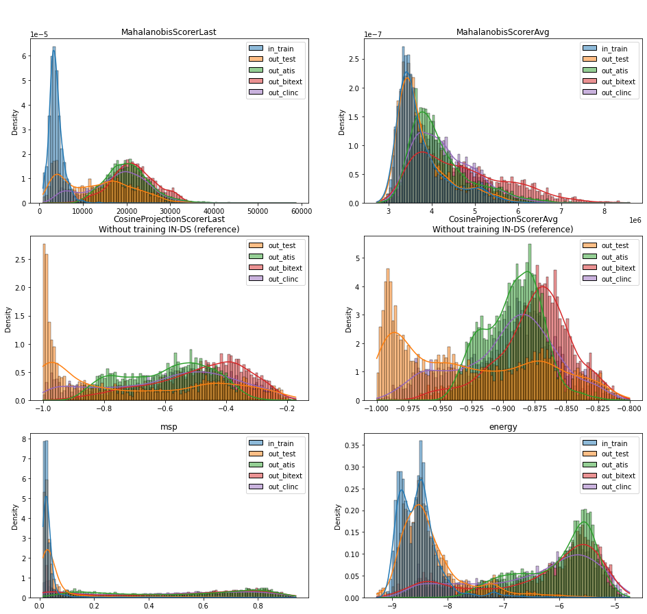

# Textual OOD Detection for Intent Classification in the Banking Industry

## Objective

With the growing number of online banks or digitalized services of traditional banks, the need for human contact for customer support drops drastically. Deep learning and natural language processing methods allow today to answer efficiently and precisely to customers' questions (via chatbots for example) and to get closer to the way a human would answer. However, it is important that these methods do not give wrong information and do not answer questions they are not capable of answering. 

**The project aims to evaluate several out-of-distribution (OOD) detection methods to overcome these problems, and focus on task of intent classification in the banking domain.** OOD detection refers to the ability of a model to identify input data that falls outside of the distribution of data it was trained on, and flag it as potentially unsafe or unreliable. Developing effective OOD detection techniques is critical for ensuring the safety and trustworthiness of large language models. 

The methodology is based on the [Todd](https://github.com/icannos/Todd) library and [ToddBenchmark](https://github.com/icannos/ToddBenchmark) framework. 

## Getting started

1. Install the required libraries using
```
pip install -r requirements.txt
```

2. Go to [`notebook`](notebook.ipynb)
    - Check the performance of different OOD detectors by loading the results in [`backup`](backup) (see the [`Results`]((notebook.ipynb)) section)
    ```python 
    records = {
        model.name: {
        dataset: load_records(model, dataset)
        for dataset in (
            "in_train", 
            "out_test", 
            "out_atis", 
            "out_bitext", 
            "out_clinc"
        )
        }
        for model in (Model.BERT, Model.DistilBERT)
    }
    ```
    - Fit your own detectors as shown in the [`Detectors`]((notebook.ipynb)) section 

## Results

The following plots depict the distribution of different OOD scoring methods. Both `MahalanobisScorer` `CosineProjectionScorer` have been computed using the `BERT`-based classifier. The plots related to `CosineProjectionScorer` only show the `OUT-DS` datasets for display purpose. This scorer is too much close to -1 for `IN-DS` entries, preventing from having a clear view on the distribution of other instances. The `msp` and `energy` scorers are derived from the classifier's logits. 



## References

### Code

- [`Todd`](https://github.com/icannos/Todd)
- [`ToddBenchmark`](https://github.com/icannos/ToddBenchmark)

### Datasets

- [banking77](https://huggingface.co/datasets/banking77)
- [ATIS Airline Travel Information System](https://www.kaggle.com/datasets/hassanamin/atis-airlinetravelinformationsystem) 
- [Bitext - Customer Service Tagged Training Dataset for Intent Detection](https://github.com/bitext/customer-support-intent-detection-training-dataset)
- [clinc150 - An Evaluation Dataset for Intent Classification and Out-of-Scope Prediction](https://github.com/clinc/oos-eval)

### Models

- [`BERT-Banking77`](https://huggingface.co/philschmid/BERT-Banking77) 
- [`DistilBERT-Banking77`](https://huggingface.co/philschmid/DistilBERT-Banking77)